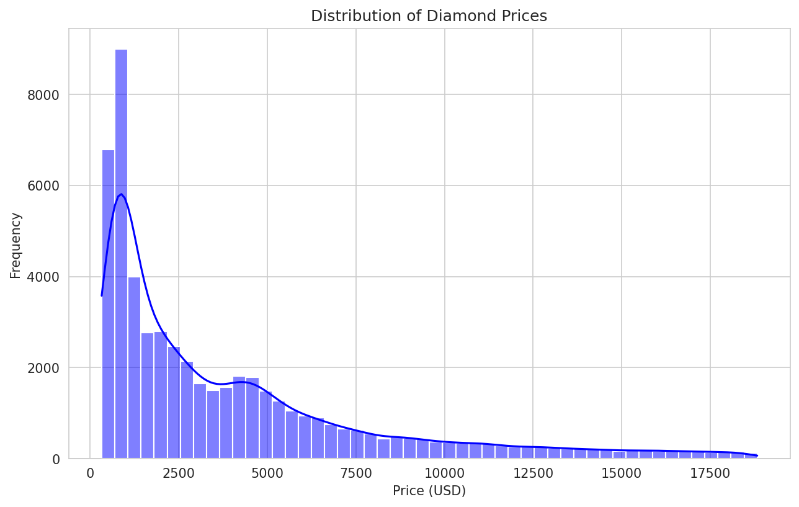
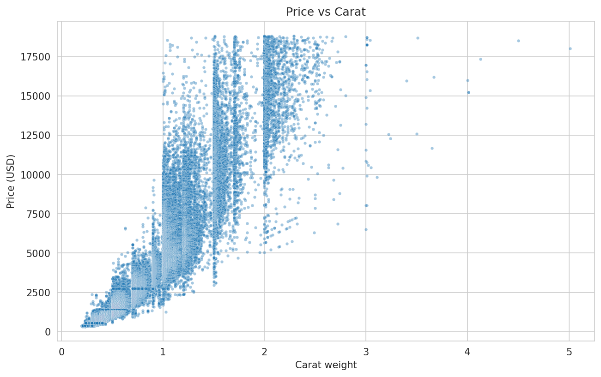
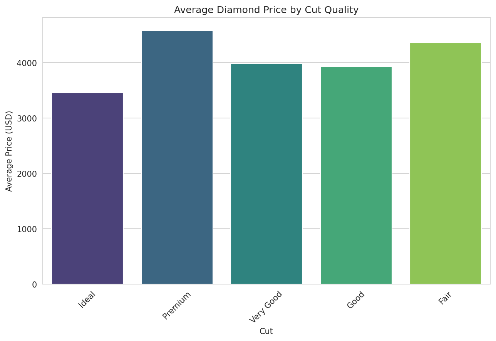
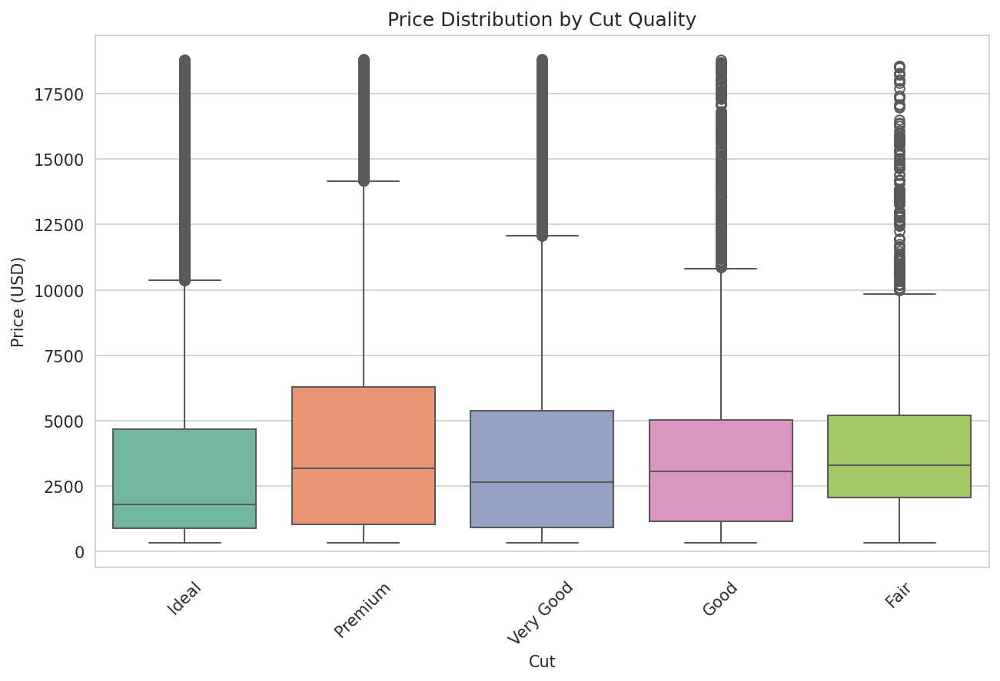
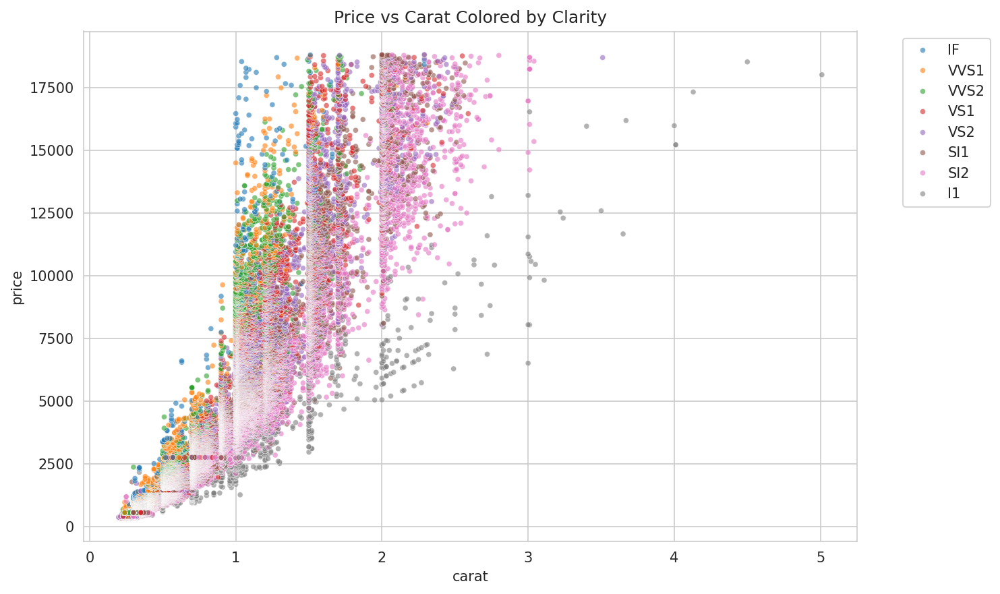
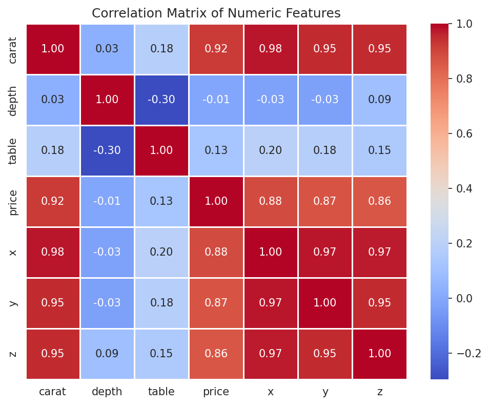

# Diamond Price Analysis

This tool performs exploratory data analysis on diamond prices to understand which features (carat, cut, color, clarity) influence the price.

## What it does

The script processes the diamonds dataset and:

1. **Loads and inspects the data** - Checks shape, data types, missing values, and summary statistics
2. **Cleans and prepares the data** - Converts categorical columns to efficient types
3. **Generates visualizations** - Creates six key plots saved in the `/result/` folder
4. **Performs grouping analysis** - Calculates average price and carat by cut and color, and identifies most expensive diamonds
5. **Prints key insights** - Summarizes findings in the console

## Example Charts

After running the analysis, you will find these charts in the `/result/` folder:

### Distribution of Diamond Prices


### Price vs Carat


### Average Price by Cut Quality


### Price Distribution by Cut (Boxplot)


### Price vs Carat Colored by Clarity


### Correlation Matrix


## How to use

1. Ensure you have the required dependencies (see Requirements below)
2. Run the analysis script using `uv`:
   ```bash
   uv run python diamond_analysis.py
   ```
3. Check the console for summary statistics and insights
4. Find all generated plots in the `/result/` folder

## Requirements

This script uses `uv` for Python package management. Make sure you have `uv` installed:
```bash
curl -LsSf https://astral.sh/uv/install.sh | sh
```
or
```
# Fedora based
sudo dnf install uv
```

## Dataset used

Generated by myself.

## Input and Output

**Input:** Built‑in `diamonds` dataset from seaborn (no external file needed)  
**Output:** 
- Console output: summary statistics, grouped results, and key insights
- `/result/` folder containing six PNG images (as shown above)
